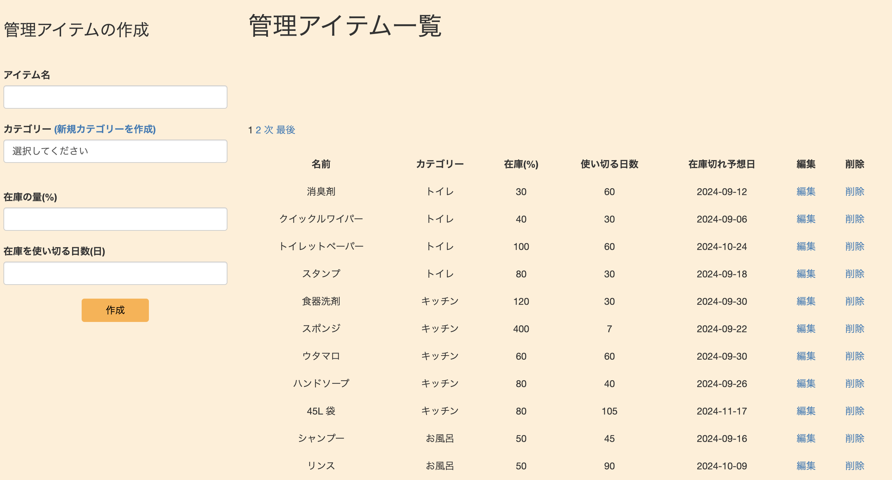
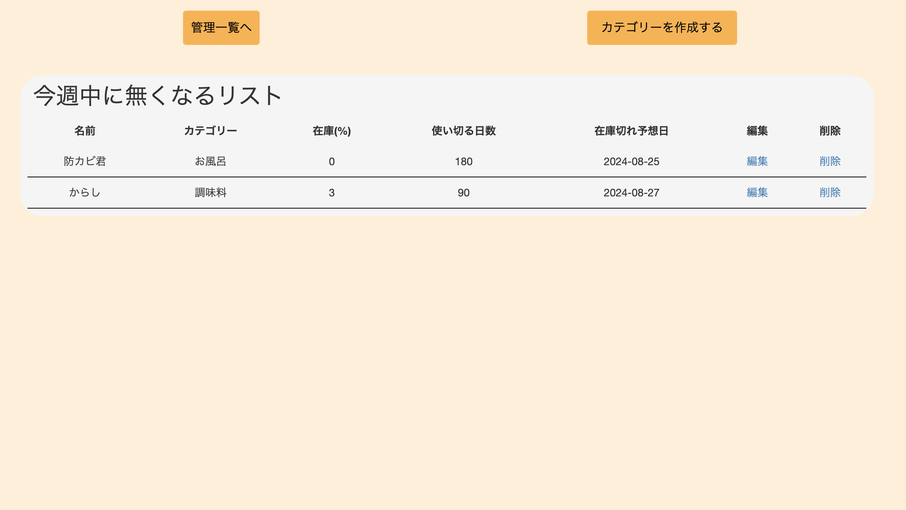

# Home Stock Manager
  家の消耗品を管理し、在庫が無くなりそうな物を一覧で表示します。
  買い忘れを防げるサービスです！

# サイト　URL
　[サイトリンク](https://homestockmanager.onrender.com/)

# サービス開発の背景
　買い物に来た時に、「そういえばシャンプーってまだあったかな」と思い,いざ帰宅すると、 
残りが少ししかなく、水を入れて薄めたことありませんか？ 
  買い忘れたことを後から気づいて、またスーパーに行く。。。 
  こんな面倒なことを防ぐために開発を始めました。 

  このサービスは、家の消耗品を管理し、使い切る目安の時間を入力することで 
  在庫が切れそうな物を一覧で確認でき、買い忘れを防げるサービスです。

# 画面・機能
  管理したい物を入力します
　

  残り1週間を切ると買い物メモとして表示されます！
  
